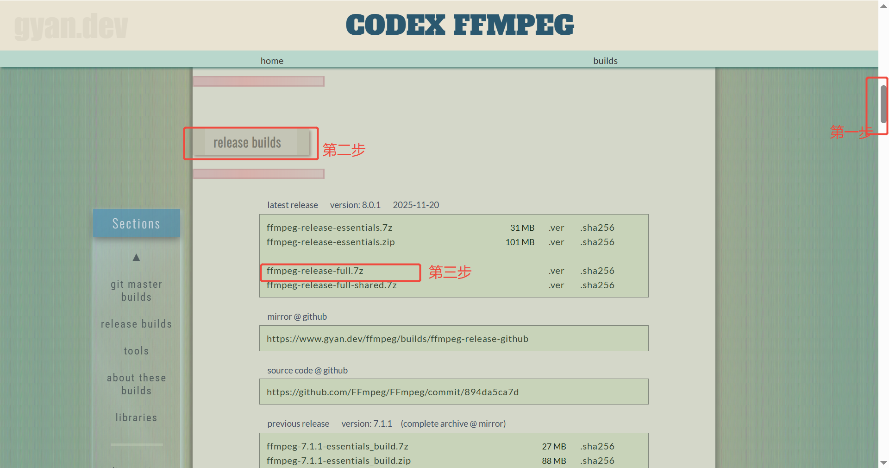
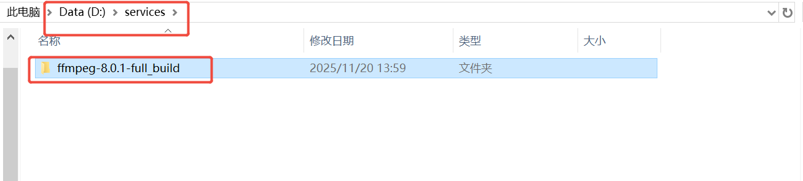
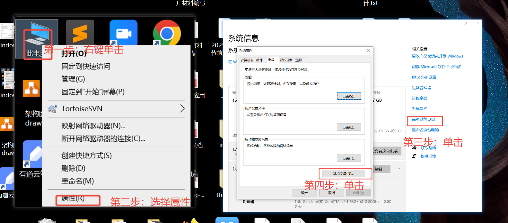
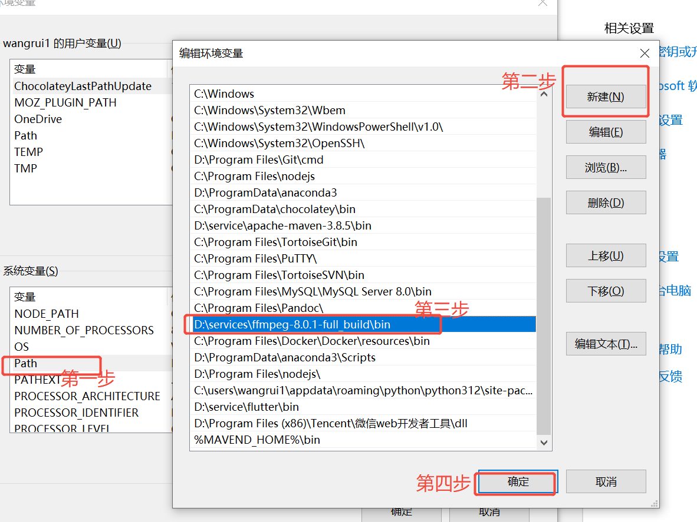
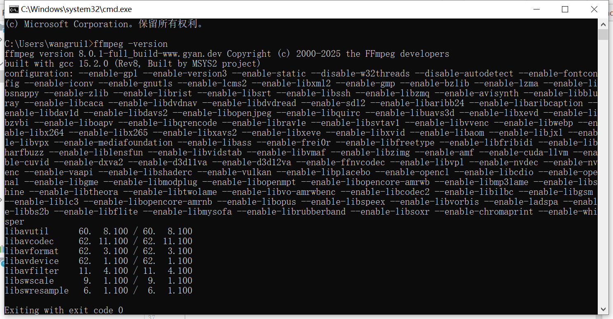

## FFmpeg简介

FFmpeg
是业界领先的多媒体处理框架，能够对人类与机器创建的几乎所有多媒体内容执行解码、编码、转码、封装、解封装、流传输、滤镜处理及播放操作。它既支持晦涩古老的格式，也兼容前沿新兴的标准 ——
无论这些格式是由标准委员会、开源社区还是企业主导设计。FFmpeg 还具备极强的可移植性：在 Linux、Mac OS X、Microsoft Windows、BSD
系列、Solaris 等操作系统上，通过各类编译环境、硬件架构及配置组合，均能成功编译、运行，并通过我们的自动化测试体系 FATE（FFmpeg
Automated Testing Environment）的验证。

- FFmpeg官网地址：[https://ffmpeg.org/](https://ffmpeg.org/)

## FFmpeg发展历程

FFmpeg 作为音视频领域的开源 “瑞士军刀”，自 2000
年诞生以来，历经初创、分裂、技术扩张与持续升级等多个阶段，逐步成为全球多媒体处理的核心框架。结合你提供的官网新闻入口及公开资料，其详细发展历程如下：

#### 1.初创与早期奠基阶段（2000 - 2010 年）

- 2000 年：法国天才程序员 Fabrice Bellard 创立 FFmpeg 项目并发布首个版本，最初仅支持 MPEG - 1 编码，项目早期许多开发者同时活跃于
  MPlayer 项目，且源码托管在 MPlayer 项目组服务器上。
- 2004 年：项目进入关键转折，Michael Niedermayer 开始主导项目维护。同年引入核心的 libavcodec 库，后续该库逐步发展为业界重要的开源编解码库，为
  FFmpeg 的功能拓展奠定基础。这一阶段，FFmpeg 逐步适配 Linux、Windows 等多系统，初步具备视频采集、格式转换等基础功能。

#### 2.分裂与并行发展阶段（2011 - 2015 年）

- 2011 年：项目遭遇重大危机，核心成员因发展理念分歧爆发分裂。创始人 Fabrice Bellard 带领部分开发者出走，创立了竞品开源项目
  Libav。此次分裂虽让 FFmpeg 陷入短暂动荡，但剩余团队坚持维护项目，两大项目此后形成 “并行竞争” 格局，反而倒逼双方加速技术迭代。
- 这一时期 FFmpeg 仍稳步推进版本更新，比如 2012 年先后发布 0.9.1、0.10 等版本，修复大量安全漏洞并提升 H.264 检索支持；2013 年
  7 月发布 2.0 版本，2014 年密集推出 2.4、2.5 等版本，持续完善编解码能力和稳定性。

#### 3.功能快速扩张阶段（2016 - 2020 年）

这一阶段 FFmpeg 适配更多主流编码标准和系统环境，逐步成为流媒体、视频工具等领域的核心依赖。
- 2016 年 2 月：3.0 版本发布，新增内置 AAC 编解码器，解决了此前依赖外部 AAC 编码组件的问题，提升了音频处理的兼容性和效率。
- 2018 年：4.0 版本发布，宣布不再支持 Windows XP，最低适配 Windows Vista，标志着其向现代化系统架构靠拢；同年 11 月的 4.1 版本，新增对
AVS2 国标的编解码器支持，开始适配国内音视频标准。
- 2019 年 8 月：4.2 版本上线，加入 AV1 和 VP4 视频的解码支持，跟进当时新兴的高效视频编码技术。
- 2020 年 6 月：4.3 版本发布，新增转场滤镜 xfade，并全面支持 Vulkan，为后续硬件加速能力的升级埋下伏笔。

#### 4.技术深耕与国产化适配阶段（2021 - 2024 年）

该阶段 FFmpeg 不仅强化核心功能，还重点适配国产技术标准和架构，同时拓展更多高级滤镜与硬件支持。
- 2021 年 4 月：4.4 版本发布，新增 AVS3 国标的解码器，进一步完善对国内自主音视频标准的支持，助力国产化多媒体项目落地。
- 2022 年：1 月发布的 5.0 版本首次支持国产龙芯架构；7 月的 5.1 版本新增对 IPFS/IPNS 协议的支持，适配分布式存储场景下的多媒体处理需求。
- 2023 年 2 月：6.0 版本上线，新增 RGBE 和 WBMP 两种图像格式支持，丰富了图像处理的适配范围。后续版本持续优化滤镜系统和编解码效率，适配
4K 等高清视频处理场景。

#### 5.现代化升级与安全强化阶段（2025 年 - 至今）

此阶段 FFmpeg 聚焦高清处理、硬件加速和安全优化，适配 AI、8K 等新技术趋势。
- 2025 年 8 月：8.0 版本（代号 “Huffman”）重磅发布，这是一次系统性升级。该版本引入 Whisper 滤镜，解锁语音识别、自动字幕生成等智能功能；支持动画
JPEG XL 编码和 FLV v2 格式，适配高质量视频和直播场景；新增 VVC VAAPI 解码器、APV 编解码器等，拓展专业领域应用。
- 硬件加速方面，8.0 版本新增 Vulkan 支持，实现 VP9 硬件加速解码和 AV1 编码，还引入 pad_cuda 等 GPU 加速滤镜。同时清理老旧依赖，放弃
OpenSSL 1.1.0 以下版本和 Yasm 汇编工具链，计划在下一版本默认启用 TLS 对等证书验证，全面提升安全性和维护效率。
如今 FFmpeg 已被 YouTube、Google Chrome、腾讯、字节跳动等众多企业和项目采用，其官网新闻栏也持续更新版本迭代、安全公告等内容，见证着这个开源项目在多媒体领域的持续进化。


- 具体版本更新记录：[https://ffmpeg.org/index.html#news](https://ffmpeg.org/index.html#news)

## Windows环境下安装FFmpeg

访问地址：[https://www.gyan.dev/ffmpeg/builds/](https://www.gyan.dev/ffmpeg/builds/)



- 第一步：滑动浏览器右侧的滑块
- 第二步：右侧找到"release builds",这里我们选中发行的稳定版。
- 第三步：点击"ffmpeg-release-full.7z"进行下载，选择最新的稳定完整版。
- 第四步：解压"ffmpeg-release-full.7z"到指定目录，例如"D:\services\ffmpeg-8.0.1-full_build"



- 第五步：添加环境变量

    - 1、打开"环境变量"设置窗口，选择"我的电脑"-"属性"-"高级系统设置"-"环境变量"

      

    - 2、在"系统变量"中，找到"Path"变量，点击"编辑"
    - 3、在"编辑环境变量"窗口中，点击"新建"，添加"D:\services\ffmpeg-8.0.1-full_build\bin"
    - 4、点击"确定"保存设置

      

- 第六步：测试安装是否成功
    - 1、键盘按组合键"cmd+r",输入"cmd" 打开"命令提示符"
    - 2、输入"ffmpeg -version"，如果显示FFmpeg的版本信息，则说明安装成功
      

## linux下安装FFmpeg

#### 使用包管理器安装（推荐）

**Ubuntu/Debian系统：**
```bash
# 更新软件包列表
sudo apt update

# 安装FFmpeg
sudo apt install ffmpeg

# 验证安装
ffmpeg -version
```

**CentOS/RHEL/Rocky Linux系统：**
```bash
# 安装EPEL仓库
sudo yum install epel-release

# 启用RPM Fusion仓库（提供完整的编解码器支持）
sudo yum localinstall --nogpgcheck https://download1.rpmfusion.org/free/el/rpmfusion-free-release-$(rpm -E %rhel).noarch.rpm https://download1.rpmfusion.org/nonfree/el/rpmfusion-nonfree-release-$(rpm -E %rhel).noarch.rpm

# 安装FFmpeg
sudo yum install ffmpeg

# 验证安装
ffmpeg -version
```

**Fedora系统：**
```bash
# 启用RPM Fusion仓库
sudo dnf install rpmfusion-free-release rpmfusion-nonfree-release

# 安装FFmpeg
sudo dnf install ffmpeg

# 验证安装
ffmpeg -version
```

#### 源码编译安装（高级用户）

源码编译可以获取最新版本并自定义配置，适合需要特定功能的用户：

**第一步：安装编译依赖**
```bash
# Ubuntu/Debian
sudo apt update
sudo apt install -y autoconf automake build-essential cmake git libass-dev libfreetype6-dev \
    libsdl2-dev libtool libva-dev libvdpau-dev libvorbis-dev libxcb1-dev libxcb-shm0-dev \
    libxcb-xfixes0-dev pkg-config texinfo wget yasm zlib1g-dev

# CentOS/RHEL
sudo yum groupinstall -y "Development Tools"
sudo yum install -y autoconf automake cmake freetype-devel libass-devel libtool \
    libvorbis-devel SDL2-devel wget yasm zlib-devel
```

**第二步：下载并编译FFmpeg**
```bash
# 创建工作目录
cd /usr/local/src
sudo git clone https://git.ffmpeg.org/ffmpeg.git ffmpeg
cd ffmpeg

# 配置编译选项（根据需要调整）
sudo ./configure --enable-gpl --enable-nonfree --enable-libass --enable-libfreetype \
    --enable-libvorbis --enable-libx264 --enable-libx265 --enable-shared

# 编译安装（时间较长，耐心等待）
sudo make -j$(nproc)
sudo make install

# 更新动态链接库缓存
sudo ldconfig

# 验证安装
ffmpeg -version
```

#### 常见问题解决

**1. 命令未找到**
```bash
# 如果ffmpeg命令未找到，检查PATH或创建软链接
which ffmpeg
sudo ln -s /usr/local/bin/ffmpeg /usr/bin/ffmpeg
```

**2. 编解码器缺失**
```bash
# 查看支持的编解码器
ffmpeg -codecs

# 如果需要特定编解码器，重新编译时添加对应配置
# 例如：--enable-libx264 启用H.264编码
```

**3. 权限问题**
```bash
# 如果遇到权限问题，确保用户有执行权限
sudo chmod 755 /usr/local/bin/ffmpeg
```

#### 性能优化建议

**硬件加速支持：**
```bash
# NVIDIA GPU加速（需要安装CUDA驱动）
sudo ./configure --enable-nvenc --enable-nvdec

# Intel Quick Sync Video
sudo ./configure --enable-libmfx
```

**多线程优化：**
```bash
# 编译时使用多核加速
make -j$(nproc)

# 运行时指定线程数
ffmpeg -threads 4 -i input.mp4 output.avi
```

## macOS下安装FFmpeg

### 使用Homebrew安装（推荐）

Homebrew是macOS最受欢迎的包管理器，安装FFmpeg最为便捷：

**第一步：安装Homebrew（如果尚未安装）**
```bash
# 安装Homebrew
/bin/bash -c "$(curl -fsSL https://raw.githubusercontent.com/Homebrew/install/HEAD/install.sh)"

# 安装完成后，按照提示将Homebrew添加到PATH中
# 对于Apple Silicon Mac：
echo 'eval "$(/opt/homebrew/bin/brew shellenv)"' >> ~/.zprofile
eval "$(/opt/homebrew/bin/brew shellenv)"

# 对于Intel Mac：
echo 'eval "$(/usr/local/bin/brew shellenv)"' >> ~/.zprofile
eval "$(/usr/local/bin/brew shellenv)"
```

**第二步：安装FFmpeg**
```bash
# 安装基础版本的FFmpeg
brew install ffmpeg

# 安装包含更多编解码器的完整版本
brew install ffmpeg --with-libvpx --with-libx264 --with-libx265 --with-libvorbis --with-libass

# 验证安装
ffmpeg -version
```

### 使用MacPorts安装

MacPorts是另一个macOS包管理器，适合有特殊需求的用户：

```bash
# 安装MacPorts（需要先从官网下载安装包）
# 官网地址：https://www.macports.org/install.php

# 安装FFmpeg
sudo port install ffmpeg

# 安装带额外功能的版本
sudo port install ffmpeg +gpl2 +gpl3 +nonfree

# 验证安装
ffmpeg -version
```

### 源码编译安装（高级用户）

对于需要最新版本或自定义配置的用户：

**第一步：安装Xcode命令行工具**
```bash
# 安装Xcode命令行工具
xcode-select --install

# 如果需要完整的Xcode IDE，从App Store安装
```

**第二步：安装依赖包**
```bash
# 使用Homebrew安装依赖
brew install autoconf cmake git libass libtool nasm pkg-config sdl2 wget \
    x264 x265 libvorbis libvpx freetype

# 或者手动下载编译特定依赖包
```

**第三步：编译安装FFmpeg**
```bash
# 创建工作目录
cd /usr/local/src
sudo mkdir ffmpeg
sudo chown $(whoami) ffmpeg
cd ffmpeg

# 下载源码
git clone https://git.ffmpeg.org/ffmpeg.git .
git checkout release/8.0  # 切换到稳定版本

# 配置编译选项
./configure --prefix=/usr/local --enable-gpl --enable-nonfree \
    --enable-libass --enable-libfreetype --enable-libvorbis \
    --enable-libx264 --enable-libx265 --enable-libvpx --enable-shared

# 编译安装
make -j$(sysctl -n hw.ncpu)  # 使用所有CPU核心
sudo make install

# 更新动态链接库缓存
sudo ldconfig

# 验证安装
ffmpeg -version
```

### macOS特有配置

#### 硬件加速支持

**VideoToolbox硬件加速：**
```bash
# 配置时启用VideoToolbox
./configure --enable-videotoolbox --enable-hwaccel=h264_videotoolbox

# 使用硬件加速编码
ffmpeg -hwaccel videotoolbox -i input.mp4 -c:v h264_videotoolbox output.mp4
```

**Metal Performance Shaders：**
```bash
# 启用Metal支持
./configure --enable-metal

# 使用Metal滤镜
ffmpeg -i input.mp4 -vf "scale_metal=1920:1080" output.mp4
```

#### 权限配置

**授予终端访问权限：**
```bash
# 在macOS 10.15+中，某些文件访问需要权限
# 系统偏好设置 > 安全性与隐私 > 隐私 > 完全磁盘访问
# 添加终端应用到允许列表中
```

**解决权限问题：**
```bash
# 如果遇到权限被拒绝的错误
sudo chmod 755 /usr/local/bin/ffmpeg
sudo chown $(whoami):staff ~/ffmpeg_output_dir
```

### 常见问题解决

**1. 命令未找到**
```bash
# 检查PATH环境变量
echo $PATH | grep -o "/usr/local/bin\|/opt/homebrew/bin"

# 如果没有找到，添加到shell配置文件
# 对于zsh（默认）：
echo 'export PATH="/opt/homebrew/bin:$PATH"' >> ~/.zshrc
source ~/.zshrc

# 对于bash：
echo 'export PATH="/usr/local/bin:$PATH"' >> ~/.bash_profile
source ~/.bash_profile
```

**2. 编解码器缺失**
```bash
# 查看支持的编解码器
ffmpeg -codecs

# 重新安装带更多编解码器的版本
brew uninstall ffmpeg
brew install ffmpeg --with-libvpx --with-libx264 --with-libx265 --with-libvorbis
```

**3. 防火墙阻止下载**
```bash
# 如果下载被防火墙阻止，手动下载依赖包
# 或使用代理：
export https_proxy=http://proxy-server:port
export http_proxy=http://proxy-server:port
```

### 性能优化

#### 利用多核处理器
```bash
# 查看CPU核心数
sysctl -n hw.ncpu

# 编译时使用所有核心
make -j$(sysctl -n hw.ncpu)

# 转码时指定线程数
ffmpeg -threads $(sysctl -n hw.ncpu) -i input.mp4 output.avi
```

#### 内存优化
```bash
# 增加内存缓冲区大小
ffmpeg -i input.mp4 -bufsize 64M output.mp4

# 使用更高效的编码预设
ffmpeg -i input.mp4 -c:v libx264 -preset veryfast -crf 23 output.mp4
```

#### SSD优化
```bash
# 使用SSD临时目录加速处理
export TMPDIR=/tmp/ffmpeg_temp
mkdir -p $TMPDIR

# FFmpeg处理时使用高速临时目录
ffmpeg -i input.mp4 -fpre fast_preset.ffpreset output.mp4
```

## docker容器方式

通过Docker安装FFmpeg可避免系统环境依赖冲突，适合开发和测试环境：

- 第一步：拉取FFmpeg官方镜像（推荐使用社区维护的稳定镜像）
    ```bash
    docker pull jrottenberg/ffmpeg:latest
    ```
- 第二步：验证镜像拉取成功
    ```
    docker images | grep ffmpeg
    ```
若输出包含jrottenberg/ffmpeg则表示拉取成功
- 第三步：运行FFmpeg容器测试功能
    ```
    docker run --rm jrottenberg/ffmpeg:latest ffmpeg -version
    ```
  若输出FFmpeg版本信息，则容器环境配置成功
- 第四步：实际使用示例（转换视频格式）
    ```
    docker run --rm -v /本地视频路径:/data jrottenberg/ffmpeg:latest -i /data/input.mp4 /data/output.avi
    ```
  说明：-v参数用于挂载本地目录到容器内的/data目录，实现文件共享  
